# **End-to-End E-commerce Engineering Analytics Platform**

##### **dbt · SQL Server · Soda · Power BI**

## Evidence at a Glance

This project is fully implemented end-to-end. Key evidence is provided below for quick verification:

- **dbt Lineage (DAG):** Layered warehouse with explicit dependencies
- **Data Quality:** dbt tests, contracts, Soda scans
- **SCD Type 2:** Historical dimension tracking with validation
- **Power BI:** Executive-ready dashboards with controlled interactivity
- **Tooling:** Local development in VS Code with structured dbt project

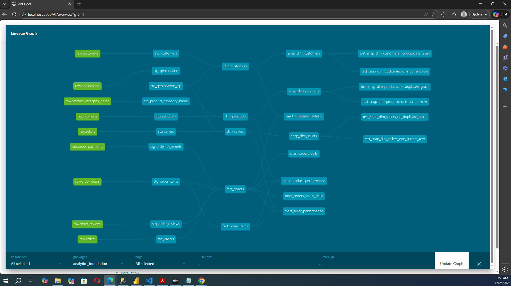
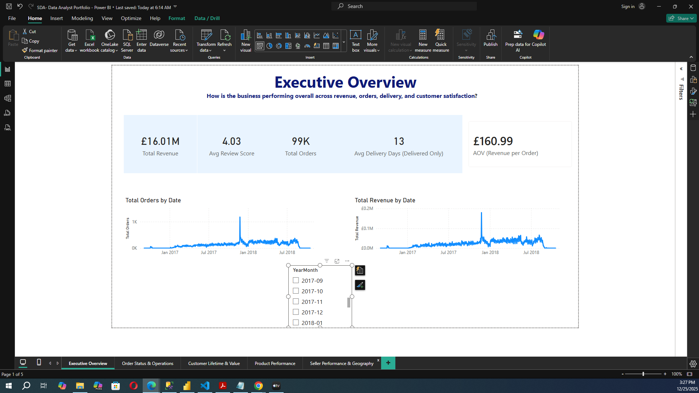
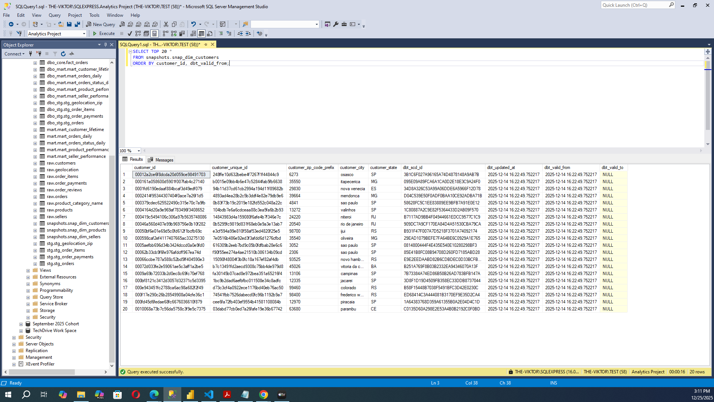

## **Executive Summary**

This project demonstrates a **modern analytics engineering workflow** for an e-commerce marketplace, from raw transactional data to executive-ready business insights.

Using **dbt + SQL Server** for transformation, **Soda** for data quality monitoring, and **Power BI** for analytics and visualisation, the project answers a core business question:

> “How is the business performing financially, operationally, and experientially — and where should leadership act?”
>
> The solution is designed to reflect **real-world industry practices**, including:

- Layered warehouse architecture
- Automated data testing and observability
- Slowly Changing Dimensions (SCD Type 2)
- Analytics-ready marts
- Decision-focused dashboards

## **Architecture Overview**

### **dbt Lineage & Model Dependencies**

The following lineage diagrams are generated from `dbt docs` and demonstrate:

- Clear separation between staging, core, marts, and snapshots
- Explicit upstream/downstream dependencies
- A single, auditable source of truth for analytics models


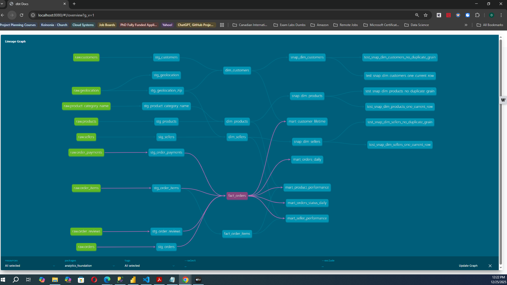

### **Data Flow**

```
Raw CSVs
↓
SQL Server (raw schema)
↓
dbt Staging Models
↓
dbt Core Models (Facts & Dimensions)
↓
dbt Marts (Analytics-ready tables)
↓
dbt Snapshots (SCD Type 2)
↓
Power BI Dashboard
```

### **Key Design Principles**

- **Single source of truth** via dbt models
- **Separation of concerns** (staging → core → marts)
- **Tested data contracts**
- **Reproducibility & lineage visibility**
- **Business-friendly schemas for BI**

## **Data Source**

- **Dataset:** Olist Brazilian E-commerce Dataset (Kaggle)
- **Domain:** Marketplace orders, customers, sellers, products, payments, reviews, logistics
- **Storage:** SQL Server Express
- **Timeframe:** 2016–2018 (limited but realistic operational window)

## **Data Quality & Testing**

### **dbt Tests**

- `not_null`
- `unique`
- `relationships`
- `accepted_values`
- Enforced **contracts** on core facts and marts

### **Custom Snapshot Tests**

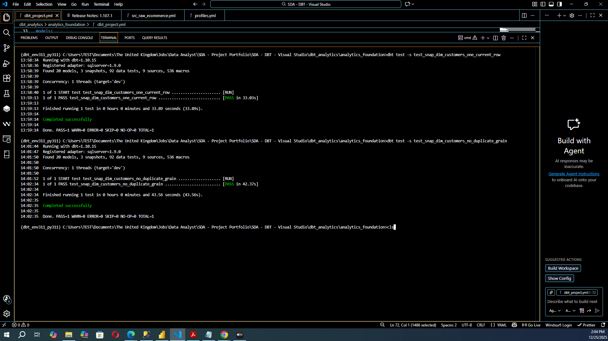

To ensure correct SCD behaviour:

- **One current row per entity**
- **No duplicate grain (business key + valid_from)**

### **Soda Checks**

- Volume checks
- Null thresholds
- Referential consistency
- Business-critical field validation

### **Data Quality Evidence**

The following screenshots show executed data quality checks and validation results:

- dbt model and snapshot tests (contracts, uniqueness, relationships)
- Soda scans covering volume, null thresholds, and referential integrity

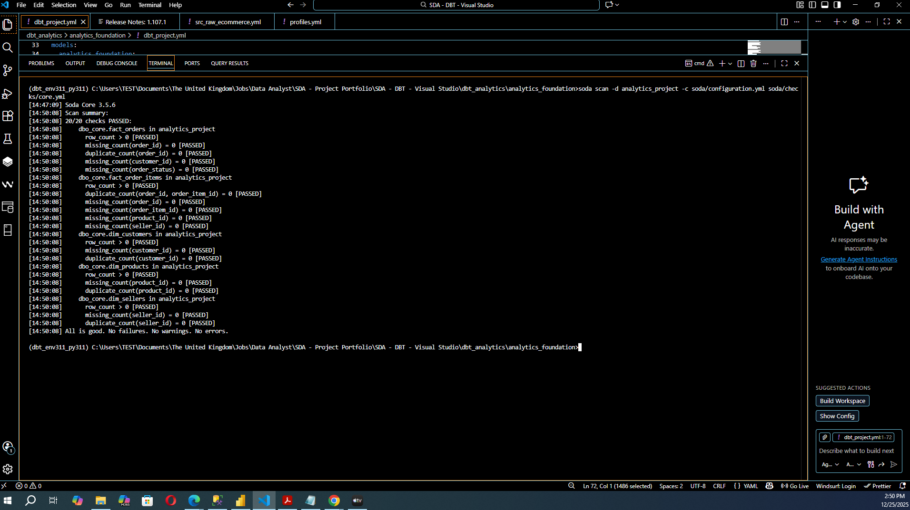
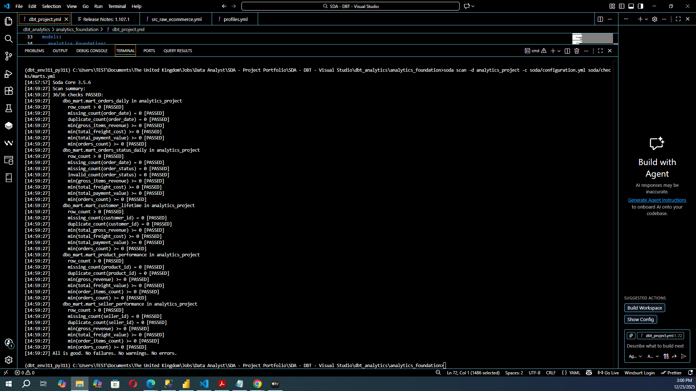

All dbt and Soda tests pass successfully, indicating and ensuring the dashboard is built on **trusted data**.

## **Slowly Changing Dimensions (SCD Type 2)**

### Snapshot Tables in SQL Server

Snapshots are materialised as physical tables in SQL Server, enabling direct inspection and auditability.

The screenshot below shows:

- Multiple historical records per business entity
- Correct `dbt_valid_from` and `dbt_valid_to` handling


Snapshots are used to track **historical changes** to key business entities:

### **Snapshot Evidence**

Snapshots are executed and documented via `dbt snapshot` and validated with custom tests.

#### **Customers**

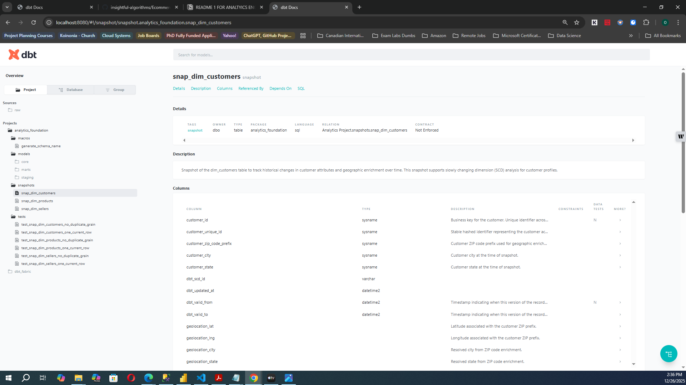

#### **Products**

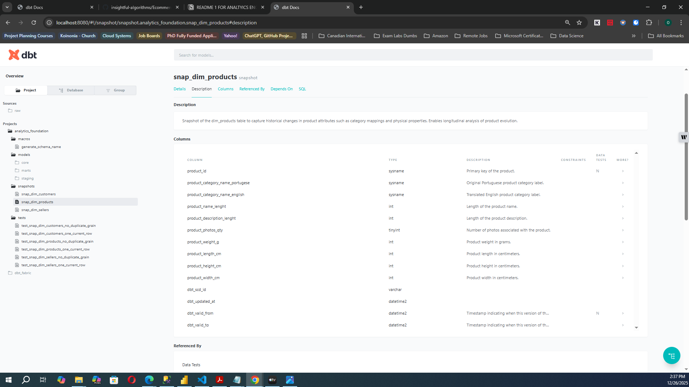

#### **Sellers**

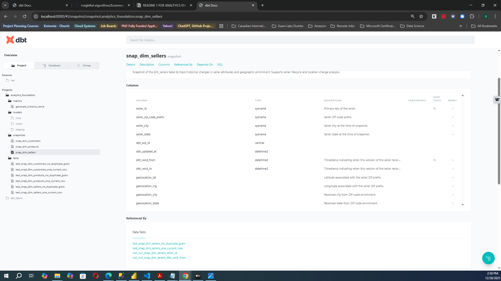

### **Why snapshots?**

- Preserve historical truth
- Enable longitudinal analysis
- Support auditability and governance

Each snapshot:

- Uses `strategy: check`
- Tracks selected business attributes
- Is fully documented and tested

## **Analytics Marts**

The marts layer exposes **BI-ready tables** designed for fast, intuitive analysis:

- `mart_orders_daily`
- `mart_orders_status_daily`
- `mart_customer_lifetime`
- `mart_product_performance`
- `mart_seller_performance`

These tables:

- Have clear business grain
- Avoid raw joins in Power BI
- Are stable under change

## **Dashboard Overview (Power BI)**

The Power BI dashboard is structured into **five decision-focused pages**, each answering a specific set of business questions.

### Dashboard Interactivity & Semantic Design

The dashboard is designed for controlled, intentional interaction:

- Centralised DAX measures (no visual-level calculations)
- Consistent slicers (YearMonth, Seller, Geography)
- Predictable cross-filtering behaviour across pages

The example below shows slicer-driven interaction without breaking measure logic or visual context.

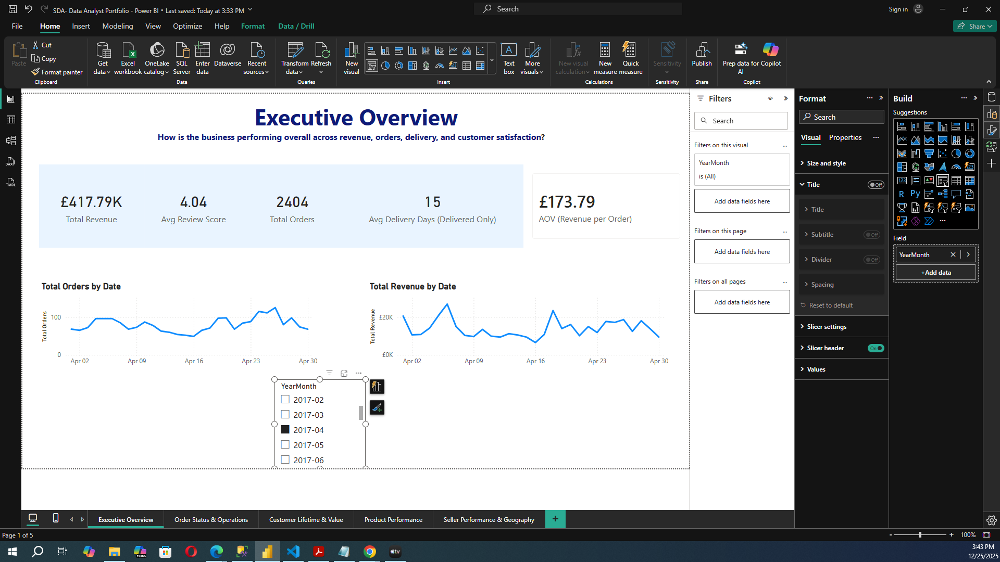
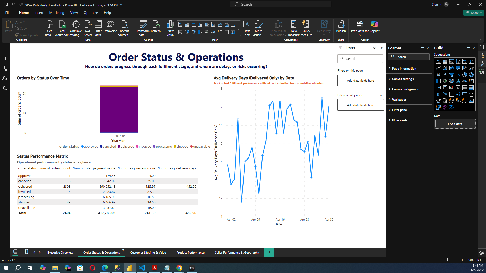

## **Executive Overview**

**Purpose:**

Provide leadership with a high-level view of overall business health.


### **Questions Answered**

- Is the business growing or declining?
- Are revenue and orders moving together?
- Is customer satisfaction stable?
- Is delivery performance acceptable?

### **Key Insights**

- Business performance is **mixed and volatile**
- Growth is **slow and fragile**
- Revenue is **volume-driven**
- Customer satisfaction is **high and stable**
- Delivery performance is **mixed but not deteriorating**
- Declining order volume is a key strategic risk

## **Order Status Operations**

**Purpose:**

Assess whether operational issues explain business performance trends.

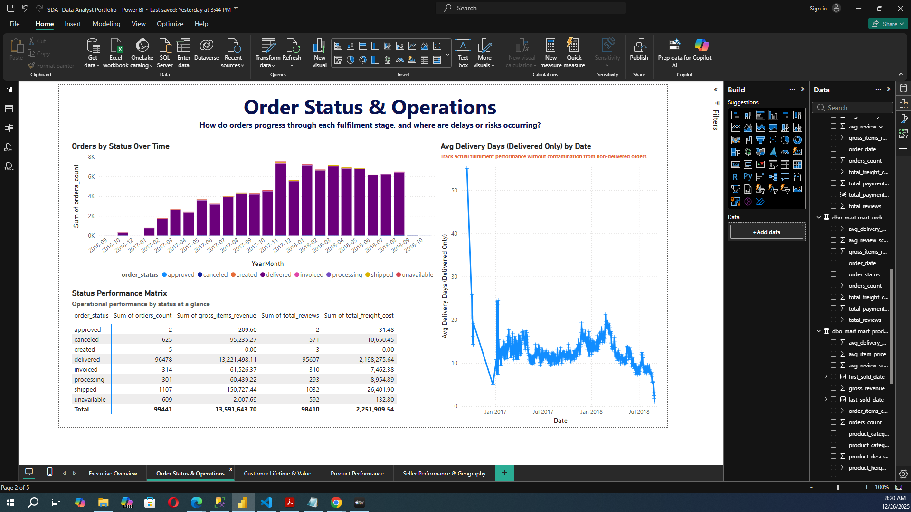

### **Questions Answered**

- Are orders successfully delivered?
- Are cancellations or failures increasing?
- Is revenue leaking due to operational issues?

### **Key Insights**

- Delivered orders **dominate**
- Problematic statuses are **minimal and stable**
- Most revenue comes from **successful deliveries**
- Operational metrics are **stable across statuses**
- Operational issues **do not explain** the decline in orders

## **Customer Lifetime Value**

**Purpose:**

Understand demand quality, retention, and geographic reach.

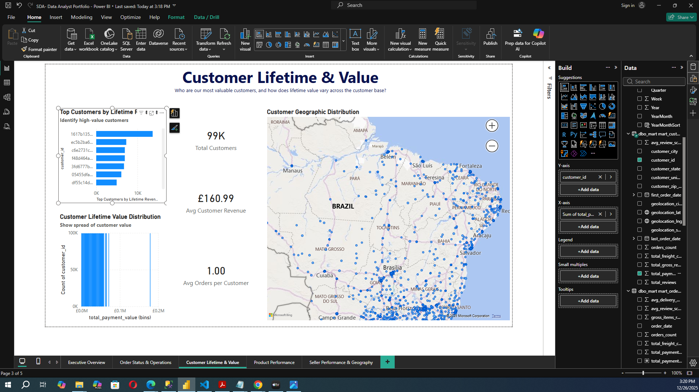

### **Questions Answered**

- Who are the most valuable customers?
- Do customers return?
- Where are customers concentrated?

### **Key Insights**

- Customer value is **highly concentrated**
- Most customers **purchase only once**
- Customer churn is **high**
- Demand is **geographically concentrated**
- High-value customers cluster in specific regions
- Customer behaviour **does explain** declining orders

**Strategic implication:**

Growth should focus on **regional targeting and demand expansion**, not operations.

## **Product Performance**

**Purpose:**

Evaluate product-level revenue, delivery, and satisfaction.

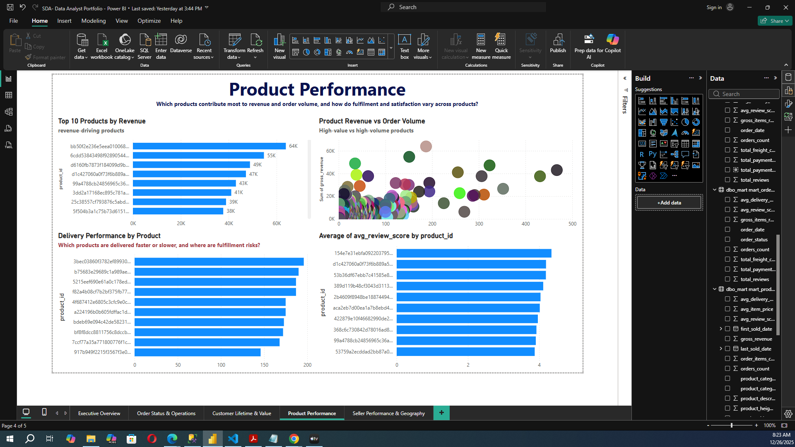

### **Questions Answered**

- Which products drive revenue?
- Are products volume- or value-driven?
- Do delivery delays affect satisfaction?

### **Key Insights**

- Revenue is **highly concentrated** among few products
- Mix of high-volume and high-value products
- Delivery delays are **uniform**, not product-specific
- Customer satisfaction is **generally high**
- Slower delivery correlates with lower reviews
- Product issues **do not explain** order decline

## **Seller Performance & Geography**

**Purpose:**

Assess supply-side concentration and geographic risk.

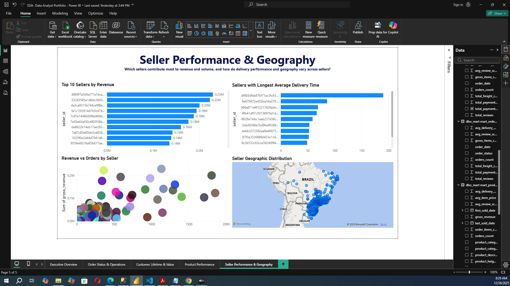

### **Questions Answered**

- Which sellers drive revenue?
- Are delivery issues seller-specific?
- Does geography affect performance?

### **Key Insights**

- Seller revenue is **highly concentrated**
- Seller performance models vary widely
- Slow delivery is **evenly distributed**
- Sellers are **geographically clustered**
- Certain locations correlate with longer delivery times
- Seller issues alone **do not explain** declining demand

**Strategic implication:**

- Onboard sellers in new regions
- Actively manage slow sellers

## **End-to-End Conclusion**

This project demonstrates that:

- **Demand-side fragility**, not operations or product quality, is the primary driver of declining orders
- Revenue, customers, products, and sellers are all **highly concentrated**
- Geographic diversification presents the strongest growth opportunity
- The analytics stack is **robust, testable, and extensible**

## **Project Structure**

The project is developed locally using VS Code with a structured dbt project layout.

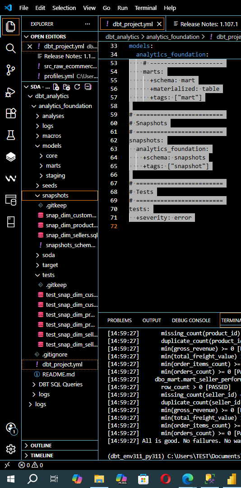

## **Skills Demonstrated**

- Analytics Engineering (dbt)
- Dimensional modeling
- SCD Type 2 snapshots
- Data quality & observability (Soda)
- SQL Server analytics
- Power BI semantic modeling
- Executive-level storytelling
- End-to-end ownership

## **How to Run**

```
dbt clean
dbt debug
dbt build
dbt snapshot
soda scan core.yml
soda scan marts.yml
dbt docs generate
dbt docs serve
```

## **Notes & Limitations**

- Dataset timeframe limits seasonality analysis
- Product and seller names are numeric identifiers
- Review data may be subject to response bias
- Insights are **directional**, not predictive

## **Contact**

**Author:** Ose Omokhua

**Linkedin:** https://www.linkedin.com/in/omokhua-ose/

**Email:** oomokhua@gmail.com

**Focus:** Analytics Engineering · Senior Data Analytics · Business Intelligence

**Tools:** SQL · dbt · Power BI
